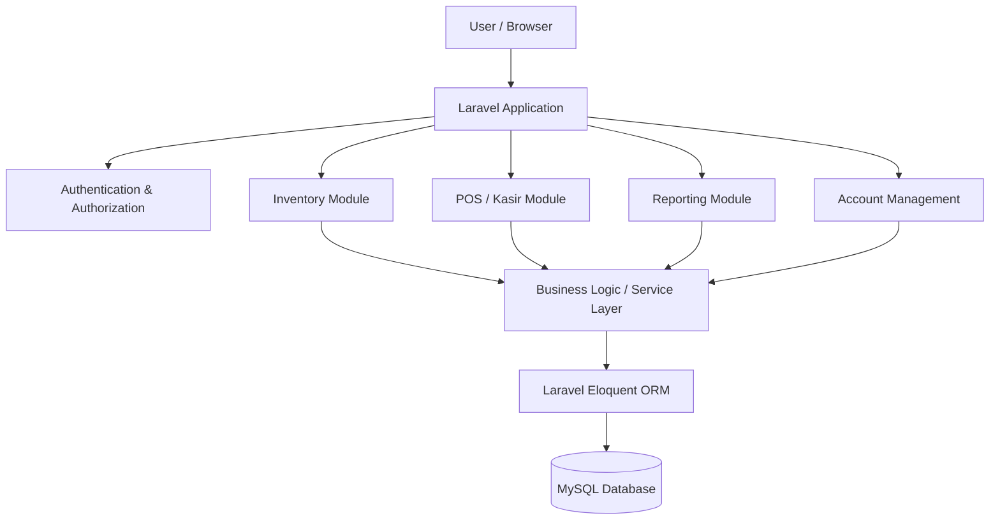
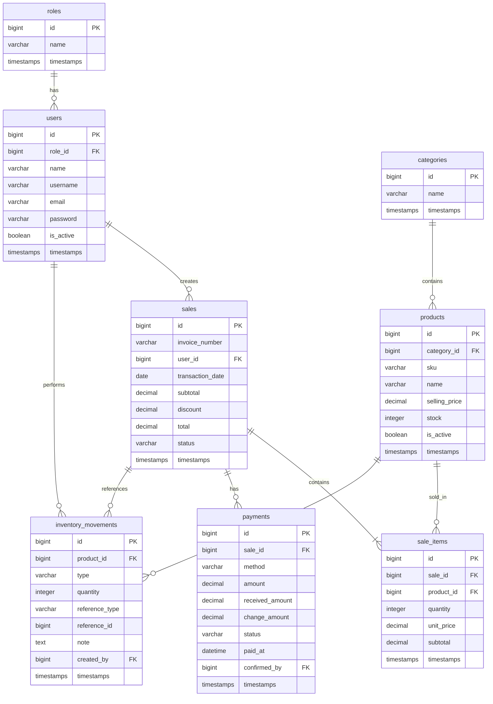
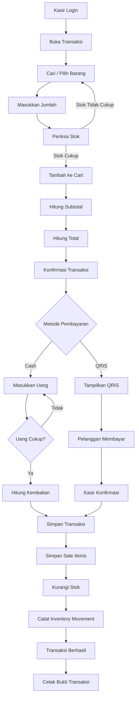

# System Design — Modul Kasir & Sistem Persediaan Toko Murah Rezeki

## 1. Overview

Dokumen ini mendefinisikan rancangan teknis sistem informasi persediaan barang dan modul kasir yang akan dibangun ulang menggunakan Laravel.

Sistem baru **bukan merupakan modifikasi langsung dari source code sistem lama**, tetapi dibangun sebagai aplikasi baru dengan proses bisnis yang tetap mengacu pada sistem lama dan hasil analisis kebutuhan penelitian.

Ruang lingkup utama:

- Authentication dan role pengguna
- Master barang
- Kategori barang
- Pengelolaan persediaan
- Pergerakan stok
- Transaksi penjualan
- Detail transaksi
- Pembayaran tunai dan QRIS
- Riwayat dan detail transaksi
- Bukti transaksi
- Laporan penjualan
- Pengelolaan akun
- Pengaturan QRIS toko

Sistem menggunakan pendekatan **monolithic web application** karena kebutuhan sistem masih terpusat pada satu aplikasi, satu database, dan dua kelompok pengguna utama: pemilik dan kasir.

---

## 2. Technology Stack

### Backend

- PHP
- Laravel
- Laravel Eloquent ORM
- Laravel Validation
- Laravel Authentication / Authorization

### Frontend

- Blade
- HTML
- CSS
- JavaScript

### Database

- MySQL

### Development

- Git
- Composer
- Node.js / npm bila dibutuhkan untuk asset build
- VS Code atau editor lain

### Deployment

Target deployment dapat menggunakan:

- Linux server
- Nginx atau Apache
- PHP-FPM
- MySQL
- Supervisor hanya bila nantinya membutuhkan queue

> Queue, Redis, microservice, dan API terpisah tidak diperlukan untuk scope awal sistem ini.

---

# 3. High-Level Architecture



## 3.1 Architecture Style

Arsitektur menggunakan pendekatan:

```text
Browser
   ↓
Laravel
   ↓
Controller
   ↓
Service / Business Logic
   ↓
Eloquent Model
   ↓
MySQL
```

Tujuannya adalah menjaga agar controller tidak menjadi tempat seluruh business logic.

---

# 4. User Roles

Sistem memiliki dua role utama.

## 4.1 Owner

Owner memiliki akses terhadap:

- Dashboard
- Data barang
- Kategori
- Persediaan
- Barang masuk
- Barang keluar
- Riwayat penjualan
- Detail penjualan
- Laporan penjualan
- Pengaturan QRIS
- Pengelolaan akun

## 4.2 Cashier

Kasir memiliki akses terhadap:

- Login
- Transaksi penjualan
- Pemilihan barang
- Cart
- Pembayaran
- Bukti transaksi
- Riwayat transaksi
- Detail transaksi

---

# 5. Main Modules

```text
System
│
├── Authentication
│
├── User & Role Management
│
├── Product Management
│   ├── Categories
│   └── Products
│
├── Inventory
│   └── Inventory Movements
│
├── Point of Sale
│   ├── Cart
│   ├── Sales
│   ├── Sale Items
│   └── Payments
│
├── QRIS
│   └── QRIS Settings
│
└── Reporting
    ├── Sales Report
    └── Inventory Report
```

---

# 6. Database Design

## 6.1 Database Principles

Database dirancang berdasarkan beberapa prinsip:

1. Master data barang dipisahkan dari transaksi.
2. Detail transaksi menyimpan snapshot harga saat transaksi berlangsung.
3. Histori perubahan stok dicatat melalui `inventory_movements`.
4. Pembayaran dipisahkan dari header transaksi.
5. User dan role dipisahkan untuk authorization.
6. Transaksi penjualan dan perubahan stok diproses secara atomic menggunakan database transaction.

---

# 7. Entity Relationship Diagram



---

# 8. Table Design

## 8.1 roles

```text
id
name
created_at
updated_at
```

Contoh:

```text
1 | owner
2 | cashier
```

---

## 8.2 users

```text
id
role_id
name
username
email
password
is_active
created_at
updated_at
```

Relasi:

```text
Role 1 ─── N Users
```

---

## 8.3 categories

```text
id
name
created_at
updated_at
```

Contoh:

```text
Makanan
Minuman
Perawatan
Kebutuhan Rumah Tangga
```

---

## 8.4 products

```text
id
category_id
sku
name
selling_price
stock
is_active
created_at
updated_at
```

`stock` merepresentasikan jumlah stok terkini.

Riwayat perubahan stok tidak disimpan pada field ini, tetapi pada `inventory_movements`.

---

## 8.5 inventory_movements

```text
id
product_id
type
quantity
reference_type
reference_id
note
created_by
created_at
updated_at
```

### Type

```text
IN
OUT
ADJUSTMENT
```

Contoh:

```text
IN          Barang masuk
OUT         Barang terjual
ADJUSTMENT  Penyesuaian stok
```

### Reference

Contoh:

```text
reference_type = sale
reference_id   = 105
```

Artinya stok berubah karena transaksi penjualan ID 105.

---

# 9. Sales Transaction

## 9.1 sales

```text
id
invoice_number
user_id
transaction_date
subtotal
discount
total
status
created_at
updated_at
```

Contoh:

```text
invoice_number = INV-20260821-0001
subtotal       = 19000
discount       = 0
total          = 19000
status         = PAID
```

### Status

```text
DRAFT
PAID
CANCELLED
```

Untuk scope penelitian awal, status paling utama adalah:

```text
PAID
```

---

## 9.2 sale_items

```text
id
sale_id
product_id
quantity
unit_price
subtotal
created_at
updated_at
```

`unit_price` harus disimpan karena merupakan snapshot harga pada saat transaksi.

Contoh:

```text
Product price sekarang = 4.000

Transaction:
unit_price = 3.500
quantity   = 2
subtotal   = 7.000
```

Perubahan harga produk di masa depan tidak boleh mengubah histori transaksi.

---

# 10. Payments

```text
id
sale_id
method
amount
received_amount
change_amount
status
paid_at
confirmed_by
created_at
updated_at
```

## Cash

Contoh:

```text
method           = CASH
amount           = 19000
received_amount  = 20000
change_amount    = 1000
status           = PAID
```

## QRIS

Contoh:

```text
method           = QRIS
amount           = 19000
received_amount  = NULL
change_amount    = 0
status           = CONFIRMED
confirmed_by     = user_id kasir
```

QRIS pada scope penelitian tidak menggunakan payment gateway atau verifikasi otomatis. Konfirmasi dilakukan oleh kasir.

---

# 11. QRIS Settings

```text
qris_settings

id
merchant_name
qr_image
is_active
created_at
updated_at
```

Tujuan tabel ini adalah menyimpan informasi QRIS toko yang ditampilkan pada halaman pembayaran.

---

# 12. Inventory Concept

Stok saat ini:

```text
products.stock
```

Histori pergerakan:

```text
inventory_movements
```

Contoh:

```text
Product: Indomie

inventory_movements

+100  IN
-2    OUT - sale #1001
-3    OUT - sale #1002
+20   IN
-1    ADJUSTMENT
```

Stok akhir:

```text
100 - 2 - 3 + 20 - 1 = 114
```

Dengan desain ini, sistem dapat mengetahui tidak hanya berapa stok saat ini, tetapi juga penyebab perubahan stok.

---

# 13. Sales Flow



---

# 14. Atomic Transaction

Penyimpanan transaksi harus menggunakan database transaction.

Secara konsep:

```text
BEGIN TRANSACTION

1. Validate stock
2. Create sales
3. Create sale_items
4. Create payment
5. Decrease product stock
6. Create inventory_movements

COMMIT
```

Jika salah satu proses gagal:

```text
ROLLBACK
```

Contoh implementasi Laravel:

```php
DB::transaction(function () use ($data) {
    // Create sale
    // Create sale items
    // Create payment
    // Update product stock
    // Create inventory movements
});
```

Tujuannya mencegah kondisi seperti:

```text
Penjualan tersimpan
+
Stok gagal diperbarui
```

---

# 15. Laravel Application Structure

```text
app/
│
├── Models/
│   ├── Role.php
│   ├── User.php
│   ├── Category.php
│   ├── Product.php
│   ├── InventoryMovement.php
│   ├── Sale.php
│   ├── SaleItem.php
│   ├── Payment.php
│   └── QrisSetting.php
│
├── Http/
│   ├── Controllers/
│   │   ├── AuthController.php
│   │   │
│   │   ├── Owner/
│   │   │   ├── DashboardController.php
│   │   │   ├── ProductController.php
│   │   │   ├── CategoryController.php
│   │   │   ├── InventoryController.php
│   │   │   ├── SalesController.php
│   │   │   ├── ReportController.php
│   │   │   ├── UserController.php
│   │   │   └── QrisSettingController.php
│   │   │
│   │   └── Cashier/
│   │       ├── DashboardController.php
│   │       ├── SaleController.php
│   │       ├── PaymentController.php
│   │       └── HistoryController.php
│   │
│   └── Requests/
│       ├── StoreProductRequest.php
│       ├── StoreSaleRequest.php
│       └── StorePaymentRequest.php
│
├── Services/
│   ├── SaleService.php
│   ├── InventoryService.php
│   └── ReportService.php
│
└── Policies/
    ├── ProductPolicy.php
    ├── SalePolicy.php
    └── UserPolicy.php
```

---

# 16. Responsibility of Each Layer

## Controller

Controller bertanggung jawab terhadap:

- menerima HTTP request
- memanggil validation
- memanggil service
- mengembalikan response / view

Controller tidak seharusnya berisi seluruh business logic.

## Service

Service menangani proses bisnis.

Contoh:

```text
SaleService
├── createDraft()
├── validateStock()
├── calculateTotal()
├── completeSale()
└── cancelSale()
```

`InventoryService`:

```text
InventoryService
├── increaseStock()
├── decreaseStock()
├── adjustStock()
└── recordMovement()
```

## Model

Model menangani:

- database mapping
- relationship
- query scope
- casting

---

# 17. Model Relationships

Contoh hubungan Eloquent:

```php
User hasMany Sale
Role hasMany User

Category hasMany Product
Product belongsTo Category

Product hasMany SaleItem
Product hasMany InventoryMovement

Sale belongsTo User
Sale hasMany SaleItem
Sale hasMany Payment

SaleItem belongsTo Sale
SaleItem belongsTo Product

Payment belongsTo Sale
```

---

# 18. Route Structure

Contoh struktur route:

```text
/login

/owner/dashboard
/owner/products
/owner/categories
/owner/inventory
/owner/sales
/owner/reports
/owner/users
/owner/qris

/cashier/dashboard
/cashier/sales
/cashier/sales/{sale}
/cashier/sales/history
/cashier/sales/{sale}/receipt
```

Route menggunakan middleware role:

```text
auth
role:owner

auth
role:cashier
```

---

# 19. Cart Design

Cart tidak perlu menjadi tabel database pada tahap awal.

Cart dapat disimpan secara sementara menggunakan session:

```text
session
└── cart
    ├── product_id
    ├── name
    ├── unit_price
    ├── quantity
    └── subtotal
```

Setelah pembayaran berhasil:

```text
Session Cart
     ↓
Sale
     ↓
Sale Items
     ↓
Payment
     ↓
Inventory Update
```

Dengan begitu database hanya menyimpan transaksi yang sudah benar-benar diselesaikan.

---

# 20. Reporting Design

Laporan penjualan dibangun dari:

```text
sales
   +
sale_items
   +
products
```

Contoh laporan:

```text
Periode        : 01-08-2026 s/d 21-08-2026

Total Transaksi : 150
Total Penjualan : Rp 12.500.000
```

Laporan detail:

```text
Invoice
Tanggal
Kasir
Jumlah Item
Total
Metode Pembayaran
```

Laporan dapat difilter berdasarkan:

- tanggal mulai
- tanggal selesai
- metode pembayaran
- kasir
- status transaksi

---

# 21. Receipt / Bukti Transaksi

Bukti transaksi mengambil data dari:

```text
sales
sale_items
payments
products
```

Contoh:

```text
TOKO MURAH REZEKI
Jl. Brigjen Katamso

INV-20260821-0001
21 Agustus 2026

Indomie     2 x 3.500   7.000
Aqua        3 x 4.000  12.000
-----------------------------
Total                   19.000
Bayar                   20.000
Kembali                  1.000

Kasir: Ahmad

Terima kasih
```

---

# 22. Authorization Matrix

| Feature            | Owner | Cashier |
| ------------------ | ----: | ------: |
| Login              |   Yes |     Yes |
| Dashboard          |   Yes |     Yes |
| Products           |   Yes |    Read |
| Categories         |   Yes |    Read |
| Inventory          |   Yes |    Read |
| Inventory Movement |   Yes |      No |
| Sales Transaction  |  Read |     Yes |
| Payment            |  Read |     Yes |
| Sales History      |   Yes |     Yes |
| Sales Detail       |   Yes |     Yes |
| Sales Report       |   Yes |      No |
| User Management    |   Yes |      No |
| QRIS Settings      |   Yes |    Read |

---

# 23. Security

Minimal security requirements:

## Authentication

- Password di-hash menggunakan Laravel Hash
- Session authentication
- Logout
- Session regeneration setelah login

## Authorization

- Role-based middleware
- Policy bila authorization semakin spesifik

## Input Validation

Semua input penting harus divalidasi:

```text
product_id
quantity
payment_method
received_amount
date_range
```

## CSRF

Gunakan CSRF protection Laravel pada semua form.

## Database

Gunakan:

- foreign key
- index pada kolom yang sering dicari
- unique constraint untuk invoice number dan SKU

---

# 24. Important Database Constraints

Rekomendasi constraint:

```text
users.role_id
    → roles.id

products.category_id
    → categories.id

sales.user_id
    → users.id

sale_items.sale_id
    → sales.id

sale_items.product_id
    → products.id

payments.sale_id
    → sales.id

inventory_movements.product_id
    → products.id

inventory_movements.created_by
    → users.id
```

Unique:

```text
users.username
users.email
products.sku
sales.invoice_number
```

---

# 25. Index Recommendation

Index pada:

```text
products.sku
products.category_id

sales.invoice_number
sales.user_id
sales.transaction_date
sales.status

sale_items.sale_id
sale_items.product_id

payments.sale_id
payments.method

inventory_movements.product_id
inventory_movements.reference_type
inventory_movements.reference_id
inventory_movements.created_at
```

Tujuannya mempercepat pencarian transaksi, laporan, dan histori stok.

---

# 26. Deployment Architecture

Untuk tahap awal:

```text
                    Internet / LAN
                         │
                         ▼
                  ┌─────────────┐
                  │    Nginx    │
                  └──────┬──────┘
                         │
                         ▼
                  ┌─────────────┐
                  │ PHP-FPM     │
                  │ Laravel     │
                  └──────┬──────┘
                         │
                         ▼
                  ┌─────────────┐
                  │   MySQL     │
                  └─────────────┘
```

Aplikasi dapat ditempatkan pada satu server.

Tidak diperlukan:

```text
Microservices
Kubernetes
Redis
RabbitMQ
Separate API Server
Separate Database Server
```

untuk scope awal.

---

# 27. Recommended Development Order

Implementasi sebaiknya dilakukan bertahap.

## Phase 1 — Foundation

```text
1. Laravel project
2. Database connection
3. Authentication
4. Roles
5. Users
```

## Phase 2 — Master Data

```text
1. Categories
2. Products
3. Stock
```

## Phase 3 — Inventory

```text
1. Inventory Movement
2. Stock In
3. Stock Out
4. Stock Adjustment
```

## Phase 4 — POS

```text
1. Product search
2. Cart
3. Stock validation
4. Total calculation
5. Checkout
```

## Phase 5 — Payment

```text
1. Cash
2. QRIS
3. Payment confirmation
4. Payment record
```

## Phase 6 — Transaction Persistence

```text
1. Sales
2. Sale Items
3. Inventory update
4. Inventory movement
```

## Phase 7 — Supporting Features

```text
1. Receipt
2. History
3. Transaction detail
4. Sales report
```

## Phase 8 — Finalization

```text
1. Authorization
2. Validation
3. Testing
4. UAT
5. Deployment
```

---

# 28. Core Business Rule

Aturan terpenting sistem adalah:

```text
Successful Sale
      ↓
Create Sale
      ↓
Create Sale Items
      ↓
Create Payment
      ↓
Decrease Product Stock
      ↓
Create Inventory Movement
```

Semua proses tersebut harus berhasil secara atomic.

Jika satu proses gagal:

```text
ROLLBACK
```

Jika semua berhasil:

```text
COMMIT
```

---

# 29. Final Architecture Summary

```text
                    ┌─────────────────────┐
                    │       Browser       │
                    └──────────┬──────────┘
                               │
                               ▼
                ┌────────────────────────────┐
                │        Laravel App         │
                │                            │
                │ ┌────────┐  ┌───────────┐ │
                │ │ Owner  │  │  Cashier  │ │
                │ └────┬───┘  └─────┬─────┘ │
                │      │            │       │
                │      └──────┬─────┘       │
                │             ▼             │
                │       Controllers         │
                │             │             │
                │             ▼             │
                │        Service Layer      │
                │             │             │
                │             ▼             │
                │       Eloquent ORM        │
                └─────────────┼──────────────┘
                              │
                              ▼
                     ┌────────────────┐
                     │     MySQL      │
                     │                │
                     │ roles          │
                     │ users          │
                     │ categories     │
                     │ products       │
                     │ inventory_...  │
                     │ sales          │
                     │ sale_items     │
                     │ payments       │
                     │ qris_settings  │
                     └────────────────┘
```

## Design Decision

Sistem ini menggunakan pendekatan **Laravel monolith dengan MySQL** karena:

- scope aplikasi masih relatif kecil;
- seluruh fungsi berada dalam satu domain bisnis;
- transaksi penjualan dan persediaan perlu konsistensi database;
- deployment menjadi sederhana;
- lebih mudah dikembangkan dan diuji dalam konteks penelitian;
- struktur tetap dapat dikembangkan apabila kebutuhan bertambah.

Struktur ini juga mempertahankan konsep bisnis dari sistem persediaan sebelumnya—barang, barang masuk, barang keluar, pengguna, dan laporan—tetapi mendesain ulang model datanya agar dapat mendukung POS secara lebih terstruktur.
